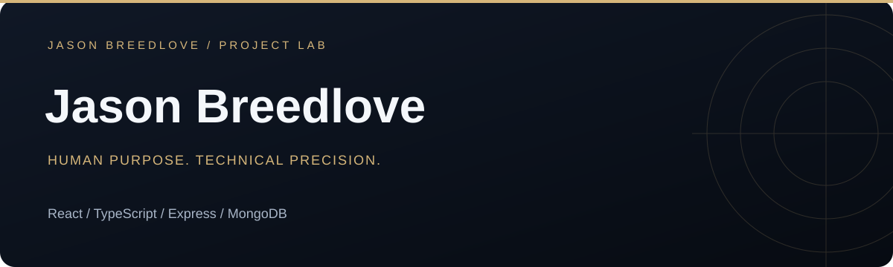

[Open live app](https://www.jasonbreedlove.dev) · [Portfolio](https://www.jasonbreedlove.dev) · [Browse source](https://github.com/Breedlove-Jason/jason-breedlove-portfolio)

# Jason Breedlove — developer portfolio

A live engineering portfolio that connects working applications, technical decisions, and professional experience. Built with React, strict TypeScript, Vite, and an Express contact API backed by MongoDB.

## Explore the work

- Filter projects by full stack, mobile and systems, Python and data, developer tools, and The Arcade.
- Open live demos, source repositories, and expandable engineering notes.
- Browse a responsive interface with keyboard controls and reduced-motion support.
- Send an inquiry through a validated contact form with persistent storage.

## Architecture

| Layer | Responsibility |
| --- | --- |
| React + TypeScript | Project cards, category filters, navigation, contact form |
| Vite + Tailwind CSS | Frontend compilation, design tokens, responsive styling |
| Express + Zod | Input validation, origin checks, rate limits, error responses |
| MongoDB | Private contact-message persistence |
| Vercel | Static frontend and the contact API entrypoint |

The decorative technology constellation is a Canvas illustration, not live telemetry.

## Local development

Requires Node.js 24+ and pnpm 11.

```sh
pnpm install --frozen-lockfile
cp .env.example .env
# Configure MONGODB_URI in your local environment.
pnpm dev
```

The frontend runs at http://127.0.0.1:5173 and proxies API requests to port 3001. The store uses the `portfolio.contact_messages` collection. Use a separate development cluster or credentials; do not run development against personal production messages.

```sh
pnpm typecheck
pnpm test
pnpm build
```

## Deployment

The live site is hosted on Vercel. `api/contact.ts` exports the contact API, uses a reusable MongoDB connection, and accepts the configured site origins. Set `MONGODB_URI` in the hosting environment. No database credentials belong in the browser bundle.

The standalone Node entrypoint in `server/index.ts` also uses MongoDB. Historical SQLite utilities remain in the repository; they are not the active hosted persistence layer.

## Contact workflow

`POST /api/contact` accepts name, email, subject, message, and an empty honeypot field. Invalid submissions receive structured errors; successful writes return a receipt. There is no public endpoint for reading submitted messages.

**The form stores inquiries; it does not send notification email.** The direct email link is a separate contact option.

## Maintain the showcase

Project data lives in `src/data/projects.ts`. Add an accurate description, stack, implementation notes, current scope, source link, and verified demo URL for each completed project. See [content provenance](docs/CONTENT_SOURCES.md).

At each project finish: review README presentation, verify live and source links, document setup and tradeoffs, and use real screenshots when available. Keep original learning-project attribution. Never publish invented metrics, test results, or credentials.

## Scope

This is a personal portfolio, not a multi-user CMS. Contact rate limiting is process-local; shared limiting would be needed for stronger cross-instance abuse controls. Public project summaries distinguish prototypes from deployed applications.
